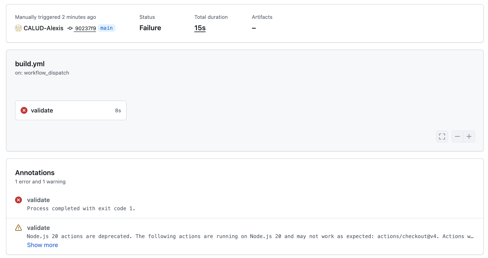

# TP CI/CD

Projet de démonstration d'une pipeline CI/CD manuelle pour valider et builder une image Docker Nginx.

---

## Structure du projet

```
tp_CICD/
├── .github/
│   └── workflows/
│       └── build.yml       # Workflow GitHub Actions
├── nginx.conf              # Configuration du serveur Nginx
├── index.html              # Page HTML servie par Nginx
├── Dockerfile              # Image Docker basée sur nginx:alpine
└── README.md
```

---

## Schéma de la pipeline

```
Déclenchement manuel (workflow_dispatch)
           │
           ▼
  ┌─────────────────────┐
  │   1. Checkout        │  ← Récupère le code source
  └────────┬────────────┘
           │
           ▼
  ┌─────────────────────┐
  │ 2. Vérif. fichiers  │  ← Contrôle la présence de :
  │                     │    nginx.conf / index.html / Dockerfile
  └────────┬────────────┘
           │
      Fichier manquant ?
      ┌────┴────┐
     OUI       NON
      │         │
    FAIL        ▼
       ┌─────────────────────┐
       │ 3. Test nginx -t    │  ← Vérifie la syntaxe nginx.conf
       │   (docker nginx:alpine)│   via un conteneur temporaire
       └────────┬────────────┘
                │
         Config invalide ?
         ┌─────┴─────┐
        OUI          NON
         │            │
       FAIL           ▼
              ┌─────────────────────┐
              │  4. Build image     │  ← docker build -t nginx-ci-demo .
              └────────┬────────────┘
                       │
                       ▼
                    SUCCESS ✓
```

